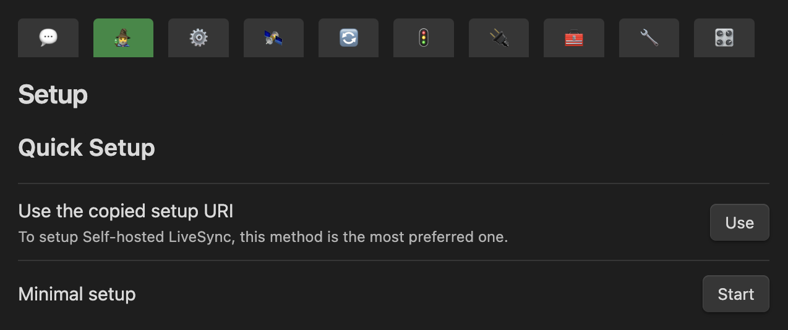

# Quick Setup

[Japanese docs](./quick_setup_ja.md) - [Chinese docs](./quick_setup_cn.md)

This plugin offers many configuration options to accommodate different scenarios. However, only a few settings are required for typical setups, and `The Setup Wizard` is designed to simplify this process.

There are three methods to set up Self-hosted LiveSync:

1. [Using Setup URIs](#1-using-setup-uris) *(Recommended)*
2. [Minimal Setup](#2-minimal-setup)
3. [Manually Setup](#3-manually-setup)

## First Device Setup

### 1. Using Setup URIs

> [!TIP]
> **What is the Setup URI? Why is it required?**
> The setup URI is an encrypted representation of the Self-hosted LiveSync configuration. It starts with `obsidian://setuplivesync?settings=` and is secured with a passphrase, enabling secure sharing between devices. While it may appear lengthy, it allows all settings to be configured in one go without inconsistencies. 
> If you have configured the remote database via [Automated setup on Fly.io](./setup_flyio.md#a-very-automated-setup) or [set up your server with the tool](./setup_own_server.md#1-generate-the-setup-uri-on-a-desktop-device-or-server), **you should have one**. 

For more details, watch [this video](https://youtu.be/7sa_I1832Xc?t=146).

**Steps:**

1. Click the `Use` button (or launch `Use the copied setup URI` from the Command Palette).
2. Paste the Setup URI into the dialogue
3. Enter the passphrase for the Setup URI.
4. Confirm the import of LiveSync's configuration by answering `yes` for "Importing LiveSync's conf, OK?".
5. Choose "Set it up as secondary or subsequent device" when asked "How would you like to set it up?".
6. Wait for initialization to complete.
7. You'll be prompted about hidden file synchronization. Answer according to your preference.
   - If you're new to Self-hosted LiveSync, you can configure this later, so skip this step for now.
8. Once synchronization starts, it's recommended to "Reload the app without saving" after the Self-hosted LiveSync indicators disappear.

You can now proceed to the [next step](#).

### 2. Minimal Setup

If you don’t have a Setup URI, click the `Start` button. This will switch the settings dialogue to wizard mode, showing only the essential options.

>[!TIP]
> You can generate a Setup URI anytime using [this tool](./setup_own_server.md#1-generate-the-setup-uri-on-a-desktop-device-or-server).

#### Select Remote Type

1. Choose the remote type from the dropdown list.
   We currently support CouchDB (and compatible databases) and object storage (MinIO, S3, R2). CouchDB is recommended, while object storage is still experimental.

#### Remote configuration 

##### CouchDB

Enter the required information for the database you've set up.

  

##### Object Storage

1. Enter the S3 API and bucket details.

  

> **Note 1:** If you use S3, the Endpoint URL can be left empty.  
> **Note 2:** If your Object Storage doesn't support CORS configuration, you might be able to connect by enabling the `Use Custom HTTP Handler` toggle.

2. Click the `Test` button to verify the connection to the Object Storage.

#### For CouchDB Only: Test Database Connection and Check Configuration

Check the database connection and settings.

  

#### For CouchDB Only: Fix Database Configuration

Review the database settings and fix any issues.

This may vary depending on your connection. If the "Fix" buttons appear, click all of them. Once they disappear and turn into checkmarks, the configuration is correct.

#### Confidentiality Configuration (Optional, but Highly Recommended)

Enable end-to-end encryption to ensure that your notes are encrypted the moment they leave your device. We strongly recommend enabling this, and `Path Obfuscation` will obscure filenames, adding an extra layer of security. Both are stable and recommended for your privacy.

These options can be disabled if you’re within a closed network and confident there is no risk of third-party access.

> [!TIP]
> Encryption uses 256-bit AES-GCM.  

Proceed to the next step.

#### Sync Settings

Complete the wizard by choosing a synchronization preset.

> **Note:** If using Object Storage, you cannot select `LiveSync`.

Choose a synchronization method and click `Apply`. If database initialization is needed, it will occur at this point. When "All done!" appears, synchronization is ready.

The dialogue to "Copy settings as a new setup URI" will automatically open. Enter a passphrase to encrypt the new Setup URI (this passphrase encrypts the URI, not the vault itself).

The Setup URI will be copied to your clipboard, please make sure to note it down (not in Obsidian).

>[!TIP]
> You can copy the Setup URI anytime by clicking `Copy current settings as a new setup URI`.

### 3. Manual Setup

While it’s strongly recommended to start with the "Minimal Setup" and configure additional settings after confirming synchronization, you can opt for manual setup if needed.

To do so, click the `Enable` button under "Enable LiveSync on this device as the setup was completed manually". Afterward, you can create a new Setup URI by selecting "Copy current settings as a new setup URI". Please make sure to note the Setup URI down (not in Obsidian).

## At the Subsequent Device
Once Self-hosted LiveSync is installed on the first device, you should have a Setup URI ready. **Using this URI is the preferred option**. Share the URI with the device you wish to set up.

The setup process is identical to the one described in [Using setup URIs on the first device](#1-using-setup-uris). For detailed steps, please refer to that section.
